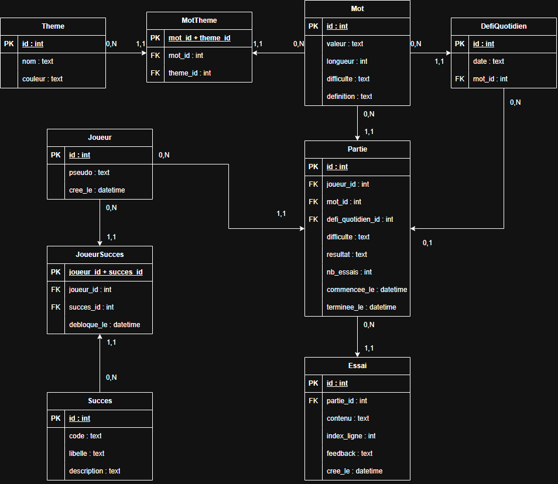

# Application MOTUS — Electron + Angular + Prisma + SQLite

Jeu de mots français façon Wordle, application de bureau développée avec Electron, Angular 21, Prisma 6 et SQLite.

---

## Prérequis

- Node.js ≥ 18
- npm ≥ 9
- Angular CLI (optionnel pour le développement) : `npm install -g @angular/cli`

---

## Installation et lancement

### Première installation (à partir de zéro)

```bash
# 1. Installer les dépendances racine (inclut tsx, electron, prisma…)
npm install

# 2. Générer le client Prisma (types TypeScript pour @prisma/client)
npm run db:generate

# 3. Créer la base SQLite, appliquer les migrations ET peupler automatiquement
#    → db:migrate déclenche le seed automatiquement via la commande
#      "prisma.seed" du package.json ("npx tsx prisma/seed.ts")
#    → L'étape db:seed manuelle n'est donc PAS nécessaire après db:migrate
npm run db:migrate

# 4. Lancer l'application (compile Electron + Angular, puis ouvre la fenêtre)
npm run start
```

> **Pourquoi `tsx` pour le seed ?**
> Prisma 6 exécute la commande seed via `spawn` sans shell, ce qui rend les opérateurs
> shell (`&&`) inopérants sur toutes les plateformes. `tsx` exécute directement le fichier
> `.ts` sans étape de compilation séparée : une seule commande, zéro shell operator,
> cross-platform (macOS / Windows / Linux).

### Démarrage rapide (après première installation)

```bash
npm run start
```

### Réinitialisation complète (reset propre)

```bash
# Supprimer la base, les artefacts compilés et les modules
rm -rf prisma/motus.db dist node_modules   # macOS/Linux
# ou sous Windows PowerShell :
# Remove-Item prisma/motus.db, dist, node_modules -Recurse -Force

# Puis relancer le cycle complet
npm install
npm run db:generate
npm run db:migrate   # recréé la DB + applique les migrations + seed automatique
npm run start
```

### Re-seed seul (sans recréer la base)

```bash
# Utile pour réinitialiser les données sans toucher aux migrations
npm run db:seed
```

---

## Scripts npm

| Script | Description |
|--------|-------------|
| `npm run start` | Build complet (Electron + Angular) et lance l'app |
| `npm run build` | Build Electron (tsc) + Angular (ng build) |
| `npm run build:electron` | Compile uniquement TypeScript/Electron |
| `npm run build:angular` | Build uniquement Angular |
| `npm run start:dev` | Lance Electron sans rebuild (après un build) |
| `npm run db:migrate` | Crée/migre la base SQLite **+ seed automatique** |
| `npm run db:generate` | Génère le client Prisma |
| `npm run db:seed` | Peuple la base manuellement (optionnel après migrate) |
| `npm run db:studio` | Ouvre Prisma Studio (interface visuelle) |

---

## Arborescence commentée

```
motus-electron-angular-prisma/
├── src/                     # Main process (Node.js / Electron)
│   ├── main.ts              # BrowserWindow + handlers IPC (pas de requêtes Prisma)
│   ├── preload.ts           # Pont contextBridge → window.api
│   ├── logique-jeu.ts       # Calcul du feedback MOTUS (côté serveur)
│   └── repository/          # Pattern Repository — toutes les requêtes Prisma
│       ├── prisma.client.ts # Singleton PrismaClient
│       ├── joueur.repository.ts
│       ├── mot.repository.ts
│       ├── theme.repository.ts
│       ├── defi.repository.ts
│       ├── partie.repository.ts
│       ├── essai.repository.ts
│       └── statistique.repository.ts
├── shared/                  # Types partagés (main + preload + Angular)
│   ├── types.ts             # Interfaces métier + DTOs + unions
│   └── electron-api.ts      # Interface ElectronAPI (contrat IPC)
├── renderer/app/            # Application Angular (renderer process)
│   ├── src/app/
│   │   ├── services/        # Services Angular (DI, signaux)
│   │   ├── pages/           # Composants routés (jeu, historique, stats, joueurs)
│   │   └── composants/      # Composants enfants (plateau, tuile, clavier)
│   └── types/electron.d.ts  # Déclaration window.api
├── prisma/
│   ├── schema.prisma        # 9 modèles + 2 enums
│   └── seed.ts              # Données de démonstration
└── docs/
    └── schemaDB_MOTUS.png   # Schéma relationnel de la base de données
```

---

## Flux de données

```
Composant Angular (page/enfant)
   → Service Angular (jeu/partie/joueur/defi/statistique.service)
      → ElectronService.getApi()         (garde sur window.api)
         → window.api  (Preload, contextBridge)
            → ipcRenderer.invoke('canal', ...args)
               → ipcMain.handle('canal', handler)    (src/main.ts, try/catch)
                  → fonction du Repository             (src/repository/*.ts)
                     → Prisma Client → SQLite (prisma/motus.db)
   ← le résultat typé remonte exactement en sens inverse
```

---

## Schéma relationnel

<!-- ════════════════════════════════════════════════════════════════════ -->
<!-- 👇  INSÉRER L'IMAGE DU SCHÉMA DE LA BASE DE DONNÉES ICI  👇            -->
<!--                                                                        -->
<!--  1. Placez votre image exportée depuis draw.io dans le dossier docs/   -->
<!--     sous le nom : schemaDB_MOTUS.png                                   -->
<!--  2. La ligne ci-dessous l'affichera automatiquement.                   -->
<!-- ════════════════════════════════════════════════════════════════════ -->



<!-- ════════════════════════════════════════════════════════════════════ -->
<!-- 👆  FIN DE L'EMPLACEMENT DE L'IMAGE  👆                                -->
<!-- ════════════════════════════════════════════════════════════════════ -->

Le schéma comporte **9 tables** et **2 énumérations** (`Difficulte`, `ResultatPartie`, stockées en `TEXT` par SQLite). Les relations entre les tables :

| Relation | Type | Cardinalités (Merise) | Clé étrangère |
|---|---|---|---|
| Joueur → Partie | 1:N | Joueur `0,N` — Partie `1,1` | `parties.joueur_id` |
| Mot → Partie | 1:N | Mot `0,N` — Partie `1,1` | `parties.mot_id` |
| DefiQuotidien → Partie | 1:N | DefiQuotidien `0,N` — Partie `0,1` | `parties.defi_quotidien_id` |
| Mot → DefiQuotidien | 1:N | Mot `0,N` — DefiQuotidien `1,1` | `defis_quotidiens.mot_id` |
| Partie → Essai | 1:N | Partie `0,N` — Essai `1,1` | `essais.partie_id` |
| Mot ↔ Theme | N:M | via `mot_theme` (PK composite) | `mot_theme.(mot_id, theme_id)` |
| Joueur ↔ Succes | N:M | via `joueur_succes` (PK composite) | `joueur_succes.(joueur_id, succes_id)` |

> **Lecture Merise** : la cardinalité se lit depuis l'entité à laquelle elle est collée. Un joueur participe à `0,N` parties ; une partie est rattachée à `1,1` joueur. Le `0,1` de `DefiQuotidien → Partie` traduit la clé étrangère **optionnelle** (`defi_quotidien_id` nullable, renseignée uniquement en mode « mot du jour »).

---

## Choix de modélisation et équivalents SQL

Cette section explique, pour chaque notion utilisée dans le projet, **à quoi elle sert**, **comment on l'écrit avec Prisma**, et **ce que ça donne en SQL**. C'est exactement ce qui sera demandé à l'oral.

### 1. Relation 1:N (un-à-plusieurs)

Un joueur peut avoir **plusieurs** parties, mais chaque partie appartient à **un seul** joueur. En base, on traduit ça par une **clé étrangère** placée dans la table « côté plusieurs » (ici `parties`), qui pointe vers la table « côté un » (`joueurs`).

```prisma
// schema.prisma — la FK est dans Partie, qui pointe vers Joueur
model Partie {
  joueurId Int
  joueur   Joueur @relation(fields: [joueurId], references: [id])
}
```
```sql
-- En SQL, c'est une colonne joueur_id dans parties qui référence joueurs(id)
CREATE TABLE parties (
  id        INTEGER PRIMARY KEY,
  joueur_id INTEGER NOT NULL,
  FOREIGN KEY (joueur_id) REFERENCES joueurs(id)
);
```

### 2. Relation N:M (plusieurs-à-plusieurs) via table de jonction

Un mot peut appartenir à **plusieurs** thèmes, et un thème regroupe **plusieurs** mots. Le SQL ne sait pas stocker ça directement : on crée une **table intermédiaire** (`mot_theme`) dont chaque ligne associe un mot à un thème. Sa **clé primaire est composée des deux clés étrangères**, ce qui empêche d'enregistrer deux fois la même paire.

```prisma
// schema.prisma — table de jonction explicite
model MotTheme {
  motId   Int
  themeId Int
  mot     Mot   @relation(fields: [motId], references: [id])
  theme   Theme @relation(fields: [themeId], references: [id])
  @@id([motId, themeId])   // clé primaire composite
}
```
```sql
CREATE TABLE mot_theme (
  mot_id   INTEGER NOT NULL,
  theme_id INTEGER NOT NULL,
  PRIMARY KEY (mot_id, theme_id),   -- la paire est unique
  FOREIGN KEY (mot_id)   REFERENCES mots(id),
  FOREIGN KEY (theme_id) REFERENCES themes(id)
);
```

### 3. `include` → charger les données liées (JOIN)

Quand je récupère une partie, je veux aussi son mot et ses essais **en une seule requête**, sans faire plusieurs allers-retours. Le `include` de Prisma joint les tables liées — c'est l'équivalent d'un **JOIN** SQL.

```typescript
// Prisma : récupère la partie AVEC son mot et ses essais
prisma.partie.findUnique({ where: { id }, include: { mot: true, essais: true } });
```
```sql
SELECT * FROM parties p
JOIN mots m   ON p.mot_id = m.id
LEFT JOIN essais e ON p.id = e.partie_id
WHERE p.id = ?;
```

### 4. `count` → compter des lignes

Pour afficher le nombre de parties gagnées, je compte les lignes qui remplissent une condition.

```typescript
prisma.partie.count({ where: { joueurId, resultat: 'GAGNE' } });
```
```sql
SELECT COUNT(*) FROM parties WHERE joueur_id = ? AND resultat = 'GAGNE';
```

### 5. `groupBy` → regrouper et compter par catégorie

Pour la répartition des essais (« combien de parties gagnées en 2 coups, en 3 coups… »), je regroupe les parties par nombre d'essais et je compte chaque groupe.

```typescript
prisma.partie.groupBy({ by: ['nbEssais'], _count: { id: true } });
```
```sql
SELECT nb_essais, COUNT(id) FROM parties GROUP BY nb_essais;
```

### 6. `aggregate` / `_avg` → calculer une moyenne

Pour la moyenne d'essais sur les parties gagnées.

```typescript
prisma.partie.aggregate({ where: { resultat: 'GAGNE' }, _avg: { nbEssais: true } });
```
```sql
SELECT AVG(nb_essais) FROM parties WHERE resultat = 'GAGNE';
```

### 7. `$transaction` → plusieurs écritures « tout ou rien »

Soumettre un essai fait **plusieurs** écritures d'affilée : créer l'essai, mettre à jour la partie, parfois débloquer un succès. La transaction garantit que **tout réussit ou rien n'est enregistré** — impossible de se retrouver avec un essai créé mais une partie non mise à jour.

```typescript
prisma.$transaction(async (tx) => {
  await tx.essai.create({ ... });
  await tx.partie.update({ ... });
});
```
```sql
BEGIN TRANSACTION;
  INSERT INTO essais (...) VALUES (...);
  UPDATE parties SET resultat = ? WHERE id = ?;
COMMIT;   -- ou ROLLBACK si une étape échoue
```

### 8. `onDelete` → que se passe-t-il quand on supprime une ligne référencée ?

Quand on supprime une ligne à laquelle d'autres tables font référence, on doit dire à la base **quoi faire des lignes dépendantes**. Le projet utilise les trois comportements :

| Comportement | Exemple dans le projet | Effet |
|---|---|---|
| `Cascade` | Supprimer un Joueur | Supprime aussi toutes ses Parties (et leurs Essais) |
| `Restrict` | Supprimer un Mot encore utilisé dans une Partie | Refusé — la base lève une erreur |
| `SetNull` | Supprimer un DefiQuotidien | Les Parties concernées gardent leur historique, leur `defi_quotidien_id` passe à `NULL` |

---

## Note sur withHashLocation()

Sous Electron, les pages sont chargées via le protocole `file://`. Sans la stratégie de hachage, Angular essaierait de naviguer vers `file:///chemin/statistiques`, qui serait interprété comme un chemin de fichier → erreur 404. Avec `withHashLocation()`, l'URL devient `file:///index.html#/statistiques` — Angular gère le fragment côté client.

```typescript
// app.config.ts
provideRouter(routes, withHashLocation())
```
